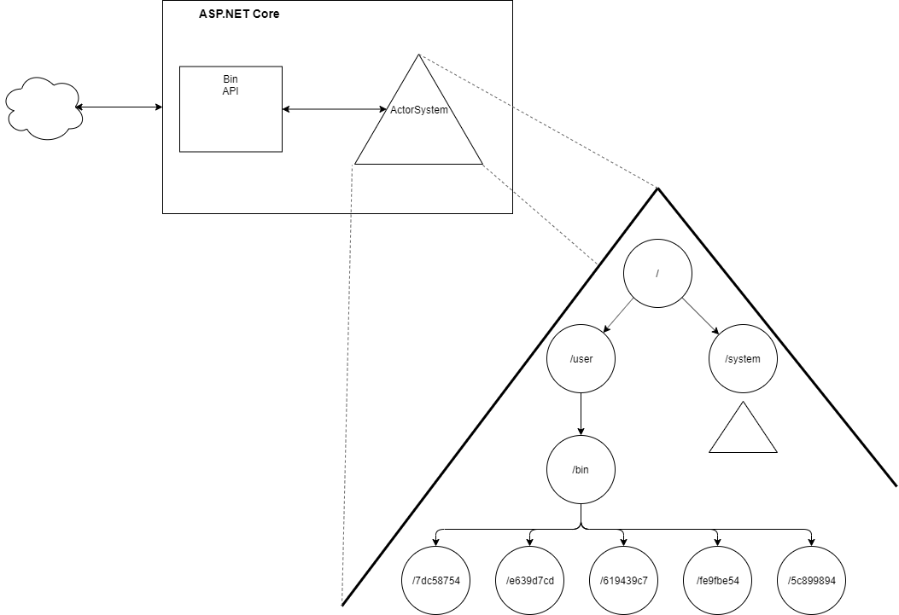

# FFTHH: Actor Model using Akka.NET

## Lesson 0 - Create your first Actor (15m)

Learn how to setup an ASP.NET Core web app that runs an Akka.NET actor system.

## Requirements

[.NET Core 2.2 SDK](https://dotnet.microsoft.com/download/dotnet-core/2.2)

[Visual Studio Code](https://code.visualstudio.com/Download)

An HTTP test tool your comfortable using (e.g. curl, Postman).


**Setup**

Clone or fork this git repository.

`https://github.com/Cobster/Axian.ActorModel.git`


This solution consists of 4 projects.

- **Axian.ActorModel**: In this main project you'll be working with Akka.NET
- **Axian.ActorModel.Tests**: This contains some predefined tests to verify things are running smoothly.
- **Axian.ActorModel.Website**: A simple ASP.NET Core Web API for some I/O.

**Install the Akka.NET nuget packages**

1. Open a shell and navigate to the solution directory.
2. Run the following commands to add the Akka libraries.

```
dotnet add src/Axian.ActorModel package Akka
dotnet add src/Axian.ActorModel.Tests package Akka.TestKit
```

**Create an ActorSystem**

Before we can create an Actor, we must first create an ActorSystem in which the Actor will live. 
An ActorSystem is a heavy-weight object, so we'll set it up as a singleton. To do this we will 
use some predefined code to provide a thin abstraction over the ActorSystem to provide a service
boundary. More on this later...

Create the actor system with a customizable name and configuration.

```c#
/* Axian.ActorModel/AxSystem.cs */

// TODO: Create an ActorSystem
ActorSystem actorSystem = ActorSystem.Create(name, config);
return new AxSystem(actorSystem);
```


Register the system as a singleton.

```c#
/* Axian.ActorModel.Website/Extensions/IServiceCollectionExtensions.cs */

// TODO: Register the ActorSystem as a singleton
services.AddSingleton(_ => AxSystem.Create(name, config));
```

Integrate the ActorSystem with ASP.NET Core.

```c#
/* Axian.ActorModel.Website/Startup.cs */

// TODO: Wire up the ActorSystem with ASP.NET Core
services.AddAxSystem("axian-ffthh-akka", "akka.conf");
```

---

<details>
<summary><strong>What's the conf file?</strong></summary>

Its a configuration file for the ActorSystem.

**What's the conf file format?**

HOCON

**What is HOCON?**

Human-Optimized Config Object Notation

**But I like JSON.**

Thats fine, JSON is HOCON. Use the provided akka.json file instead.

```c#
// TO DO: Wire up the ActorSystem with ASP.NET Core
services.AddAxSystem("axian-ffthh-akka", "akka.json");
```

**Neat.**

HOCON is not JSON, go [learn more about HOCON](https://github.com/lightbend/config/blob/master/HOCON.md#hocon-human-optimized-config-object-notation).

</details>

---

Next we need to wire up the ActorSystem lifecycle with the web app.

Since the ActorSystem is registered as a singleton, all we need to do is retrieve it from
the service collection to create the instance and thus startup the actor system.

```c#
/* Axian.ActorModel.Website/Extensions/IApplicationLifetimeExtensions.cs */

// TODO: Create an ActorSystem on start up
lifetime.ApplicationStarted.Register(() => container.GetService<AxSystem>());
```

We also need to handle shutdown,

```c#
/* Axian.ActorModel.Website/Extensions/IApplicationLifetimeExtensions.cs */

// TODO: Stop the ActorSystem when stopping
lifetime.ApplicationStopping.Register(() => container.GetService<AxSystem>().Terminate());
```

Let's get this system fired-up!

```
dotnet run -p .\src\Axian.ActorModel.Website
```

Open `http://localhost:29426/api/sys` in a browser. If everything is working
you should see a response similiar to:

```json
{
  "name":"axian-ffthh-akka",
  "startTime":"2019-11-19T08:39:46.793+00:00",
  "uptime":"00:00:00.8529191"
}
```

<details>
<summary>
<strong>Why port 29426?</strong>
</summary>

Any valid port will work, but 29426 has significance. Can you figure it out why?

</details>

Okay, now that the ActorSystem is running, it's time to create our first actor. 
Create a class named `UntypedGreeter`, inherit from `Akka.Actor.UntypedActor`, and
override the `OnReceive` method.

```c#
/* Axian.ActorModel/UntypedGreeter.cs */

public class UntypedGreeter : Akka.Actor.UntypedActor
{
    protected override void OnReceive(object message) 
    {

    }
}
```

Whenever the Greeter receives a message, we want to respond to the sender with simple message.
Let's write a test for that.

```c#
/* Axian.ActorModel.Tests/GreeterSpecs.cs */

[Fact]
public void UntypedGreeter_should_always_respond_hello()
{
    // Arrange
    IActorRef greeter = Sys.ActorOf(Props.Create<UntypedGreeter>());

    // Act
    greeter.Tell("hi!");

    // Assert
    string response = ExpectMsg<string>();
    Assert.Equal("hello", response);
}
```

Then let's make it pass by overriding the `OnReceive` method and responding back to the sender.

```c#
/* Axian.ActorModel/UntypedGreeter.cs */

// TODO: Override OnReceive
protected override void OnReceive(object message) 
{
    Sender.Tell("hello");
}

```

Run the tests
```
dotnet test
```

<details>
<summary>
<strong>What is Sys.ActorOf?</strong>
</summary>

`Sys` in this test is the ActorSystem. `ActorOf` instructs the ActorSystem to create an instance  of the actor and return a reference to the new actor.  It's also responsible for assigning the  actor an address and setting up the actor's mailbox.

</details>

<details>
<summary>
<strong>What is Props.Create?</strong>
</summary>

An `Akka.Actor.Props` is essentially a recipe for an actor. The ActorSystem uses this to create instances whenever they're needed. 

Props are immutable and should be serializable. Thus they can easily be sent to other Actors in messages. This enables some very interesting creation design patterns.

</details>

<details>
<summary>
<strong>Why an IActorRef instead of the Greeter?</strong>
</summary>

Sorry, Akka does not let you talk directly to an Actor. The `IActorRef` is essentially the address to the Actor. And you use the `IActorRef` to either `Tell` or `Ask` the Actor something. Either way the message will land in the Actor's mailbox, and sometime later the actor will decide what to do with the message. 

This is important, because an Actor could throw an exception and be recreated by the ActorSystem. The new Actor instance will have the same address as the failed instance and thus the IActorRef can continue to be used for sending messages.

Or it's also possible that the IActorRef represents multiple Actors, like a [broadcast group or an elastic round robin pool](https://getakka.net/articles/actors/routers.html).

This also enables location transparency. Using the `Akka.Remote` or `Akka.Cluster` libraries makes it possible for an Actor to live on a different physical hosts. The IActorRef makes sending remote messages no different than sending local messages (but requires messages to be serializable).

An `IActorRef` is immutable and serializable. Making it easy to include in them in messages. 
This allows Actors to share addresses, and enables some interesting communication patterns.
</details>

**Grats! You've created your first actor.**


Now let's do the same thing using a ReceiveActor.

Create a new class named **ReceiveGreeter**.

```c#
/* Axian.ActorModel/ReceiveGreeter.cs */

public class ReceiveGreeter : Akka.Actor.ReceiveActor
{

}
```

Let's write another test.

```c#
/* Axian.ActorModel.Tests/GreeterSpecs.cs */

[Fact]
public void ReceiveGreeter_should_always_respond_hello()
{
    // Arrange
    IActorRef greeter = Sys.ActorOf(Props.Create<ReceiveGreeter>());

    // Act
    greeter.Tell("hi!");

    // Assert
    string response = ExpectMsg<string>();
    Assert.Equal("hello", response);
}
```

Then let's make it pass by defining a constructor which calls the `ReceiveAny` method, providing a lambda that responds to the sender.

```c#
/* Axian.ActorModel/ReceiveGreeter.cs */

// TODO: Override OnReceive
public ReceiveGreeter()
{
    ReceiveAny(msg => {
      Sender.Tell("hello");
    });
}

```

Run them tests.
```
dotnet test
```

Here are some other things to try out to continue exploring.

- custom responses based on the message value
- custom responses based on the message type
- send multiple responses
- store some state (e.g. message count)
- throw an exception
- don't handle the message


---


## Lesson 1: HttpRequest capture app (60m)

Let's create HTTP request capture app, a simplistic clone of [postb.in](https://postb.in).

**Requirements**

  - Users should be able to create a bin.
  - Should be able to list all the bins
  - Each bin should have a unique endpoint for capturing HTTP requests
  - Captures any HTTP request sent to the the bin endpoint.
    - Any HTTP verb
    - Captures verb, address, query string, headers, and body.
  - Stores a configurable number of the most recent requests.
  - Lists all the stored requests in a bin.
  - Bins expires after a configurable amount of time.

### Akka.NET topics covered

- Parent/Child Actors
- Scheduler
- Configuration

### System Design




### Setup

Run the following git command to get a starting point.

```
git cherry-pick lesson1
```

This adds the `Bin` and `BinManager` classes to the `Axian.ActorModel` project and some predefined tests to help guide you through the process of building the http request capture system.

This portion of FFTHH is structured a bit differently.  There are a total of 13 unit tests defined within the `Axian.ActorModel.Tests/Lesson1/BinSpec.cs` and `Axian.ActorModel.Tests/Lesson1/BinManagerSpec.cs` test fixtures. Starting with the `BinSpec.cs`, uncomment the tests one at a time and provide an implementation that will make the test pass. If you're having a bit of trouble, uses the implementations below to help fill the gaps.


#### BinSpec.cs
<details>
<summary><strong>_00_should_be_able_to_Put_items_in_the_bin</strong></summary>


`Akka.ActorModel.Status.Success` and `Akka.ActorModel.Status.Failure` are simple built-in messages types that are useful for ACK and NAK responses.

```cs
/* Axian.ActorModel/Bin.cs */

public Bin()
{
    Receive<Put>(cmd => Sender.Tell(new Status.Success("ok")));
}
```

</details>

<details>
<summary><strong>_01_should_list_items_stored_in_the_bin</strong></summary>

```cs
/* Axian.ActorModel/Bin.cs */

private readonly List<object> _items = new List<object>();

public Bin()
{
    Receive<Put>(cmd => {
        _items.Add(cmd.Data);
        Sender.Tell(new Status.Success("ok"));
    });

    Receive<List>(query => Sender.Tell(new ListResponse(_items)));
}
```

</details>

<details>
<summary><strong>_02_should_list_items_in_reverse_chronological_order</strong></summary>

```cs
/* Axian.ActorModel/Bin.cs */

public Bin() 
{
    // ...
    Receive<List>(query => Sender.Tell(new ListResponse(_items.AsEnumerable().Reverse())));
}

```
</details>

<details>
<summary><strong>_03_should_be_able_to_configure_the_maximum_number_of_stored_items</strong></summary>

First make it compile by adding an `Akka.Configuration.Config` parameter to the constructor.
Use the provided `DefaultConfig` whi

```cs
/* Axian.ActorModel/Bin.cs */

public Bin(Config config)
{
    // ...
}
```

Then create a new default constructor which passes in the `Akka.Actor.ActorSystem` configuration.

```cs
/* Axian.ActorModel/Bin.cs */

public Bin() : this(Context.System.Settings.Config)
{
}
```
Next update the constructor to get the configured `axian.bin.max-items` value, and use it to control the removal of the oldest stored item when handling a `Put` command.

```cs
/* Axian.ActorModel/Bin.cs */

public Bin(Config config)
{
    int maxItems = config.GetInt("axian.bin.max-items");

    Receive<Put>(cmd => {
        
        // remove the oldest item when capped
        if (_items.Count == maxItems) {
            _items.RemoveAt(0);
        }

        _items.Add(cmd.Data);
        Sender.Tell(new Status.Success("ok"));
    });

    // ...
}

```

This passes the test, but breaks the other tests. Fix them by adding a default value to `default.conf`, and using the `DefaultConfig` as a fallback configuration.

```
# default.conf

axian.bin.max-items = 1000

```

```cs
/* Axian.ActorModel/Bin.cs */

public Bin(Config config)
{
    config = config.SafeWithFallback(DefaultConfig.Instance);

    // ...
}
```


</details>

<details>
<summary><strong>_04_should_be_able_to_configure_how_long_the_bin_stays_alive</strong></summary>

Get the `axian.bin.ttl` value from the configuration as a TimeSpan. Then have the bin schedule an `Akka.Actor.PoisonPill` message to be sent to itself in the future.

```cs
/* Axian.ActorModel/Bin.cs */

public Bin(Config config)
{
    // ...

    TimeSpan ttl = config.GetTimeSpan("axian.bin.ttl");

    Context.System.Scheduler.ScheduleTellOnce(ttl, Self, PoisonPill.Instance, Self);

    // ...
}
```


</details>

#### BinManagerSpec.cs
<details>
<summary><strong>_00_CreateBin_should_respond_with_bin_name</strong></summary>

Create a receive handler that sends the correct response message.

```cs
/* Axian.ActorModel/BinManager.cs */

public BinManager()
{
    Receive<CreateBin>(cmd => Sender.Tell(new CreateBinResponse("")));
}
```
</details>

<details>
<summary><strong>_01_CreateBin_every_bin_should_have_a_unique_name</strong></summary>

Create a unique name for each bin that is created.

```cs
/* Axian.ActorModel/BinManager.cs */

public BinManager()
{
    Receive<CreateBin>(cmd => {
        string name = Guid.NewGuid().ToString();
        Sender.Tell(new CreateBinResponse(name));
    });
}
```
</details>

<details>
<summary><strong>_02_ListBins_should_return_the_name_of_all_bins</strong></summary>

Start off by responding with the expected message.

```cs
/* Axian.ActorModel/BinManager.cs */

public BinManager()
{
    // ...

    Receive<ListBins>(qry => {
        Sender.Tell(new ListBinsResponse(new string[0]));
    });
}

```

Next add some internal state to index the bins by its name. Modify the CreateBin handler to add the name to the index. Then update the ListBins handler to respond with all the bin names.

```cs
/* Axian.ActorModel/BinManager.cs */

private readonly Dictionary<string,IActorRef> binsByName = new Dictionary<string, IActorRef>();

public BinManager()
{
    Receive<CreateBin>(cmd => {
        string name = Guid.NewGuid().ToString();
        binsByName.Add(name, null);
        Sender.Tell(new CreateBinResponse(name));
    });

    Receive<ListBins>(qry => {
        Sender.Tell(new ListBinsResponse(binsByName.Keys));
    });
}
```

</details>

<details>
<summary><strong>_03_CaptureRequest_should_forward_request_to_the_bin_and_respond_success</strong></summary>

I guess it's about time we actually create a `Bin` as a child actor, and add it to the dictionary.

```cs
/* Axian.ActorModel/BinManager.cs */

public BinManager()
{
    Receive<CreateBin>(cmd => {
        string name = Guid.NewGuid().ToString();
        IActorRef bin = Context.ActorOf<Bin>(name);
        binsByName.Add(name, bin);
        Sender.Tell(new CreateBinResponse(name));
    });
}
```

Then define a `CaptureRequest` handler that forwards a Put message to the correct `Bin` actor. Have the `Bin` actor respond to sender of the `CaptureRequest`.

```cs
/* Axian.ActorModel/BinManager.cs */

public BinManager() 
{
    // ...

    Receive<CaptureRequest>(cmd => {
        if (binsByName.TryGetValue(cmd.Bin, out IActorRef bin))
            bin.Tell(new Bin.Put(cmd.Data), Sender);
    });
}
```

</details>

<details>
<summary><strong>_04_CaptureRequest_should_not_respond_when_bin_doesnt_exist</strong></summary>

Cool, it already handles this case...moving on.

</details>

<details>
<summary><strong>_05_ListRequests_should_forward_request_to_the_bin</strong></summary>

Once again, find the correct bin to use, then tell the `Bin` to list its contents and respond to the sender of the `ListRequests` query.

```cs
/* Axian.ActorModel/BinManager.cs */

public BinManager()
{
    // ...

    Receive<ListRequests>(qry => {
        if (binsByName.TryGetValue(qry.Bin, out IActorRef bin))
            bin.Tell(new Bin.List(), Sender);
    });
}
```
</details>

<details>
<summary><strong>_06_ListRequests_should_not_respond_when_bin_doesnt_exist</strong></summary>

Sweet another one that just works. 
</details>

<details>
<summary><strong>_07_ListBins_should_not_return_any_expired_bins</strong></summary>

This test requires configuration, so modify the `BinManager` constructor to accept an `Akka.Configuration.Config`, then create a new default constructor which supplies the actor system's configuration.

```cs
/* Axian.ActorModel/BinManager.cs */

public BinManager(Config config)
{
    // ...
}

public BinManager() : this(Context.System.Settings.Config)
{   
}
```

Then modify how the `Bin` child actors are created by passing in the config.
Once we have the `IActorRef` of the `Bin`, we can use the `Watch` method to register our interest in receiving a `Terminated` message when the `Bin` has stopped.

```cs
/* Axian.ActorModel/BinManager.cs */

public BinManager(Config config)
{
    Receive<CreateBin>(cmd => {
        string name = Guid.NewGuid().ToString();
       
        IActorRef bin = Context.ActorOf(Props.Create(() => new Bin(config)));
        Context.Watch(bin);

        binsByName.Add(name, bin);
        Sender.Tell(new CreateBinResponse(name));
    });

    // ...

}
```

Since we are interested in `Terminated` messages, be better define a new receive handler. But the message gives `IActorRef` of the terminated bin, we need the name for our book keeping. As a quick fix, we'll introduce another dictionary with the reverse mapping.

```cs
/* Axian.ActorModel/BinManager.cs */

private readonly Dictionary<IActorRef,string> namesByBin = new Dictionary<IActorRef,string>();

public BinManager(Config config)
{
    Receive<CreateBin>(cmd => {
        string name = Guid.NewGuid().ToString();
        IActorRef bin = Context.ActorOf(Props.Create(() => new Bin(config)));
        Context.Watch(bin);
        binsByName.Add(name, bin);

        namesByBin.Add(bin,name);

        Sender.Tell(new CreateBinResponse(name));
    });

    Receive<Terminated>(msg => {
        string name = namesByBin[msg.ActorRef];
        binsByName.Remove(name);
        namesByBin.Remove(msg.ActorRef);
    });

}

```

</details>

### API Design

Update the `Axian.ActorModel.Website/Controllers/BinController.cs` to integrate with the actor system.

<details>
<summary><strong>Create a bin</strong></summary>

```
POST /bin
```

**Response**
```
200 OK

{
    name: string
    captureUrl: string
    logUrl: string
}
```

**Code**
```cs
/* Axian.ActorModel.Website/Controllers/BinController.cs */

[HttpPost]
public async Task<IActionResult> CreateBin()
{
    var command = new BinManager.CreateBin();
    var response = await _binManager.Ask<BinManager.CreateBinResponse>(command);
    var model = BuildResponseModel(response.Bin);
    return Ok(model);
}
```

</details>

<details>
<summary><strong>List bins</strong></summary>

```
GET /bin
```

**Response**
```
200 OK

{
    bins: [
        {
            name: string
            captureUrl: string
            logUrl: string
        }
    ]
}
```

**Code**
```cs
/* Axian.ActorModel.Website/Controllers/BinController.cs */

[HttpGet]
public async Task<IActionResult> ListBins()
{
    var command = new BinManager.ListBins();
    var response = await _binManager.Ask<BinManager.ListBinsResponse>(command);
    var model = BuildResponseModel(response.Bins);
    return Ok(model);
}
```

</details>

<details>
<summary><strong>Store an HTTP request in a bin</strong></summary>

```
ANY_HTTP_VERB /bin/:binId
```

**Response**
```
200 OK
```

**Code**
```cs
/* Axian.ActorModel.Website/Controllers/BinController.cs */

[Route("{bin}", Name = nameof(CaptureRequest))]
[AcceptVerbs("GET","POST","PUT","DELETE","PATCH","OPTIONS","HEAD","TRACE")]
public async Task<IActionResult> CaptureRequest(string bin)
{
    try 
    {
        object requestModel = await CaptureHttpRequestInfo();
        var command = new BinManager.CaptureRequest(bin, requestModel);
        await _binManager.Ask<Status.Success>(command);
        return Ok();
    }
    catch (AskTimeoutException)
    {
        return NotFound();
    }
}
```

</details>

<details>
<summary><strong>List HTTP requests stored in a bin</strong></summary>

```
GET /logs/:binId
```

**Response**
```
200 OK

{
    name: string
    captureUrl: string
    logUrl: string
    requests: object[]
}
```

**Code**
```cs
/* Axian.ActorModel.Website/Controllers/BinController.cs */

[Route("/logs/{bin}", Name = nameof(ListRequests))]
public async Task<IActionResult> ListRequests(string bin)
{
    try 
    {
        var command = new BinManager.ListRequests(bin);
        var response = await _binManager.Ask<Bin.ListResponse>(command);
        var model = BuildResponseModel(bin, response.Items);
        return Ok(model);
    }
    catch (AskTimeoutException)
    {
        return NotFound();
    }
}
```

</details>